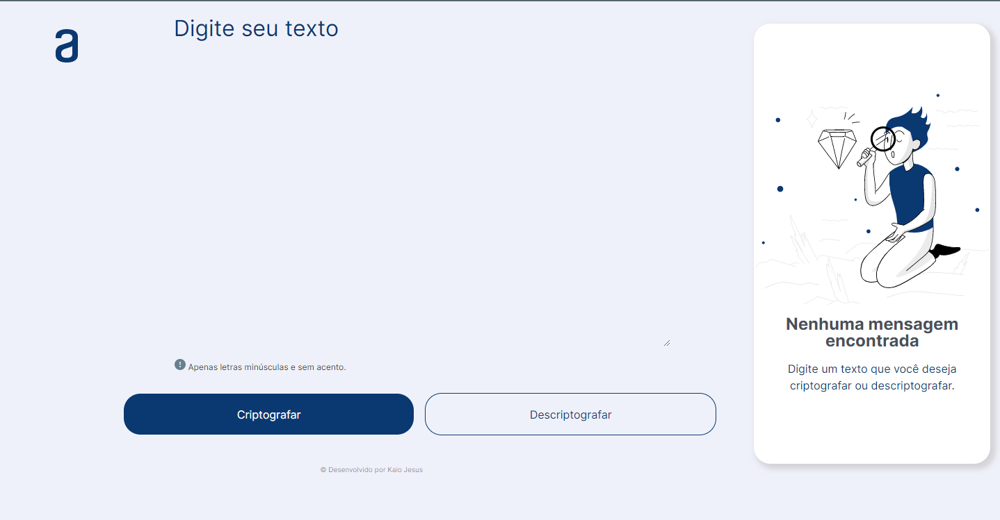
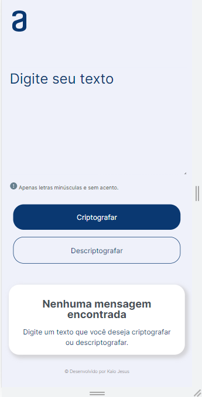

# ChallengeAluraOracle - Codificador

 Esta é uma página desenvolvida para resolver um desafio da Alura + Oracle. 
 
 ## Table of contents
- [Descrição](#Descrição)
- [Telas](#Telas)
- [Links](#Links)
- [Ferramentas](#Ferramentas)
- [Aprendizado](#Aprendizado)
- [Contato](#Contato)

### Descrição

Esse é um challenge introdutório da trilha de programação Alura + Oracle que consiste em criptografar e descriptografar a palavra ou mensagem escrita. 

A seguir o modelo utilizado para realizar a criptografia:<br>
>***A letra "e" é convertida para "enter"<br>
>A letra "i" é convertida para "imes"<br>
>A letra "a" é convertida para "ai"<br>
>A letra "o" é convertida para "ober"<br>
>A letra "u" é convertida para "ufat"***

Exemplo do que foi utilizado para a codificação:
```
    .replace(/imes/gi,'i')
```

#### Requisitos:
- Deve funcionar apenas com letras minúsculas
- Não devem ser utilizados letras com acentos nem caracteres especiais
- Deve ser possível converter uma palavra para a versão criptografada e também retornar uma palavra criptografada para a versão original.

Por exemplo:
>"gato" => "gaitober" <br>
>gaitober" => "gato"


### Telas





### Links

[Solution URL](https://kaiojesus.github.io/ChallengeAluraOracle/assets/index.html)


### Ferramentas

- HTML 5
- CSS
- Javascript
- Git e GitHub

### 📝 Aprendizado

Com este desafio aprendi:
- A utilizar o método replace, além de praticar o que foi aprendido nos cursos da Alura;
- Pegar o valor de um input e mostrar na tela e substituir o que tá sendo mostrado;
- Fazer um botão para copiar o que tá sendo mostrado;
- Utilizar um pouco do display grid.

### ✉ Contato 

- [LinkedIn](https://www.linkedin.com/in/kaio-jesus/) 
- [kaiojesus41@gmail.com](kaiojesus41@gmail.com)


